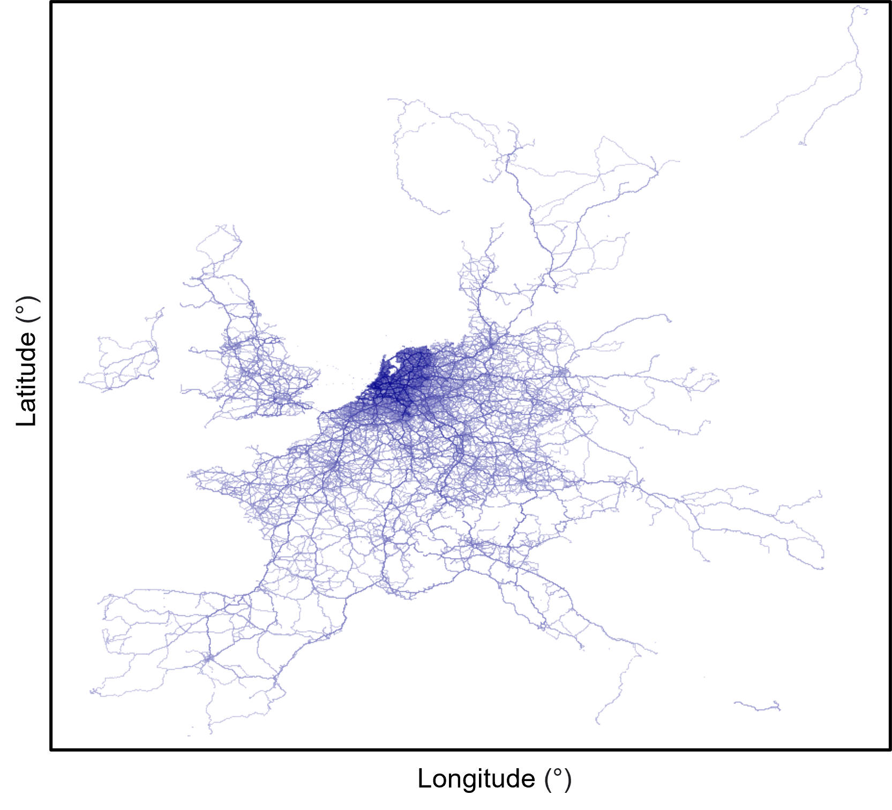
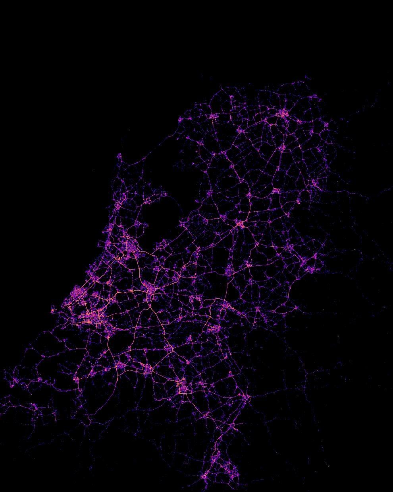

Stability in Truck Driving Behaviour: A Geo-Specific Analysis
=================================================

<!-- [](https://creativecommons.org/publicdomain/zero/1.0/)
[](https://github.com/mhucka/readmine/releases)
[](https://data.caltech.edu/records/20173) -->


Table of contents
-----------------

- [Stability in Truck Driving Behaviour: A Geo-Specific Analysis](#stability-in-truck-driving-behaviour-a-geo-specific-analysis)
  - [Table of contents](#table-of-contents)
  - [Introduction](#introduction)
  - [Installation](#installation)
  - [Dataset Description](#dataset-description)
  - [Code Description](#code-description)
  - [Getting help](#getting-help)


Introduction
------------
This repository is part of the Msc thesis project, which can be found in the [TU Delft repository](https://repository.tudelft.nl/islandora/search/?collection=education).
As part of the project geo-specific analysis conducted for Dutch Field Operational Test(FOT), known as the Anti-ongevalsystemen [AOS-FOT](https://wiki.fot-net.eu/index.php/AOS). In the current study, an analysis of driving data from 1,727 trucks recorded over one year between September 2008 – May 2009 (across Europe). The aim is to explore stability in truck driving behaviour with a focus on time and location (urban areas and motorways).


Installation
------------

All the required libraries can be installed using requirement.txt, which can be found in the root directory.

1. Open a terminal or command prompt.
2. Navigate to the folder with your requirements.txt.
3. Run the following command:

```bash
pip install -r requirements.txt
```

4. You are done installing dependencies.

Dataset Description
-----
The dataset used in this study was recorded as part of a large-scale FOT aimed at assessing accident prevention systems by the Dutch Ministry of Infrastructure and Water Management. Connekt conducted a large-scale field operational test for trucks with active driver assistance systems, also known as accident prevention systems (APS). Five different accident prevention systems and a registration system were tested on Dutch highways over eight months. The test’s purpose was to understand better the extent to which accident prevention systems can contribute to traffic safety and traffic flow on the Dutch road network. Until now, the contribution of these systems has only been examined to a limited extent [1].

The dataset consists of two types of data - Orderly Use data (Trip data), and Main AOS Data (AOS Events data).

1. TRIP: TRIP folder consists of SUMMARY and DETAIL files. The detailed folder contains the orderly use data described below. Features were recorded every 2 km.

| Feature       | Description                                                  |
| ---------------- | ------------------------------------------------------------ |
| Numberplate      | License plate number used to identify vehicles|
| Point_date-stamp | Date per point|
|Point_time-stamp  | Time per point|
| Latitude         |GPS: 3 digits to denote the integer part + 6 decimal digits|
|Longitude         | GPS: 3 digits to denote the integer part + 6 decimal digits|
|Meters_travelled  |m: Meters travelled from previous point|
|Time_elapsed      |sec: Seconds elapsed from previous point|
|Point_speed|km/h|
|Road_type|According to TeleAtlas: -3=not available, 0=urban, 1=motorway, 2=extra-urban, 3=other|
|Speed_restriction|According to TeleAtlas, km/h|
|Admin_area|According to TeleAtlas, standard name for Order 8 area|
|TNO_Time-stamp|Control variable|


   
Fig. below depicts trips recorded across Europe during the field operational test. The data was recorded for over 96 × 106 kilometres.

<p align="center"></p>

2. Main AOS Data: Recorded using Mobile Eye. Contrary to Trip data, this data produced a warning when an event is triggered (the driver receives a real-time alert). The events include:
   1. Braking Events
   2. Headway Warnings: (Level I/II/III-HW)
   3. Right and Left Indicator: (R/L-I)
   4. Right and Left Lane Departure Warnings: (R/L-LDW)

The figure below visualizes the different events recorded in the Netherlands.

<p align="center"></p>

Code Description
-----


In order to explore stability correlation analysis has been used to examine if there exists a linear relationship between variables. To further understand how stable different ranges are for a particular metric, clustering analysis has been used. The spatial stability analysis has been split based on the environment i.e. urban areas and motorways.

All the jupyter notebooks can be found inside [tdstability](truck-driver-profile/tdstability/) folder.

| File             | Description                                                  |
| ---------------- | ------------------------------------------------------------ |
| [eda](truck-driver-profile/tdstability/eda.ipynb) | Used to perform exploratory data analysis for both Trip and AOS data. It also contains temporal stability analysis.|
| [extract_trips_two_locs_motorway](truck-driver-profile/tdstability/extract_trips_two_locs_motorway.ipynb)  | Code to extract trips between two locations.|
| [urban_area_clustering](truck-driver-profile/tdstability/urban_area_clustering.ipynb)   | Correlation and clustering analysis for urban areas|
| [motorway_clusternig](truck-driver-profile/tdstability/motorway_clusternig.ipynb)   |Correlation and clustering analysis for motorways|
| [discussion](truck-driver-profile/tdstability/discussion.ipynb)       | Exploring effect of vehicle characteristics on stability|


Getting help
------------

The dataset used in this study is not publicly available. You can contact [Dr. Joost de Winter](https://www.tudelft.nl/staff/j.c.f.dewinter/?cHash=d01a3e86b28de77014b7c235534246c9) or [Dr. Dimitra Dodou](https://www.tudelft.nl/staff/d.dodou/?cHash=86e7804ff8c203cd17c148eddf8a72ac) for further details.


[1] Aos for net wiki,” Apr 2015. [Online]. Available: https://wiki.fot-net.eu/index.php/AOS